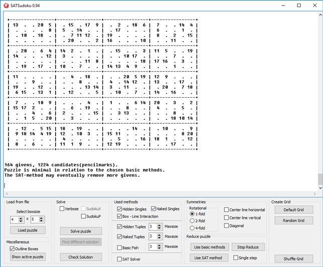

# sudokuNxM solver and generator

The NxM-Sudoku is a generalization of the standard <a href="https://en.wikipedia.org/wiki/Sudoku">3x3 Sudoku</a> with 9 squares of size 3x3 and a total of 81 cells. In the general case we have N\*M rectangles of size NxM and a total of (N*M)2cells.

      
 Though there are standard Sudokus which are almost impossible to solve only with logical reasoning by humans, from a computational point of view solving a standard Sudoku is almost trivial. Since the general problem is <a href="https://en.wikipedia.org/wiki/NP-completeness">NP-complete</a> finding a solution gets more demanding for larger grids.

      
We choose an approach where we simplify the given NxM-Sudoku as far as possible using &quot;human&quot; methods like hidden and naked singles and tuples, block-line interaction etc. and transform the remaining problem into a <a href="https://en.wikipedia.org/wiki/Boolean_satisfiability_problem">boolean satisfiability problem</a>. We then use <a href="http://www.sat4j.org/">Sat4J</a> for solving.

      Besides solving of Sudokus the program also includes features like generating Sudokus, testing for unique solutions etc.
      

  
  
 ## <a href="http://kociemba.org/themen/sudoku/program.html">Windows executable, program usage and description.</a>
